# SQL Assignment

# Simple Questions

1. Retrieve the first 5 members from the Members table

`select * from Members limit 5;`

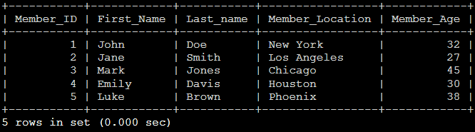

2. Retrieve 5 members starting from the 6th row

`select * from Members limit 5 offset 5;`

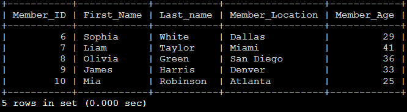

3. List members who are older than 30 years

`select * from Members where Member_Age > 30;`

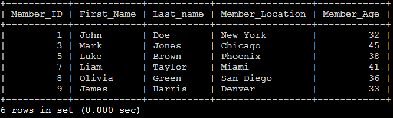

4. Find members who live in either New York or Los Angeles

`select * from Members where Member_Location in( 'New York' , 'Los Angeles');`

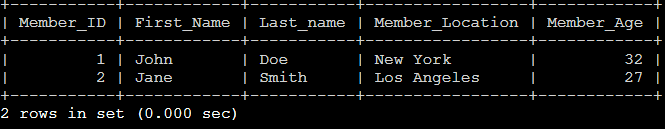

5. Retrieve all vehicles where the make is either 'Toyota' or 'Honda'

`select * from Vehicles where Vehicle_Make in ( 'Toyota', 'Honda' );`

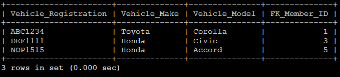

6. Find members whose age is between 25 and 40 years

`select * from Members where Member_age between 25 and 40;`

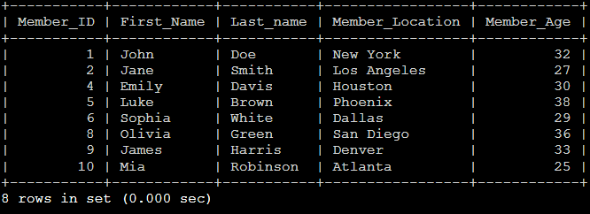

7. List vehicles whose registration number starts with the letter 'A'

`select * from Vehicles where Vehicle_Registration like ‘A%’;`

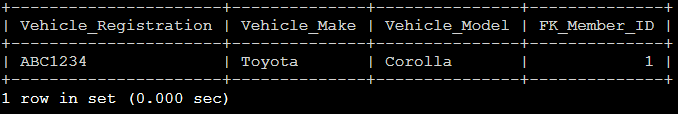

8. Find vehicles where the model ends with the number '5'

`select * from Vehicles where Vehicle_Model Like '%5';`

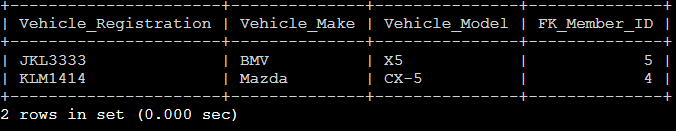

9. List all engineers and order them alphabetically by their last name

`select * from Engineers Order by Last_Name ASC;`

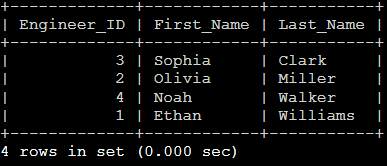

10. Retrieve all members and order them by age in descending order

`select * from Members order by Member_Age DESC;`

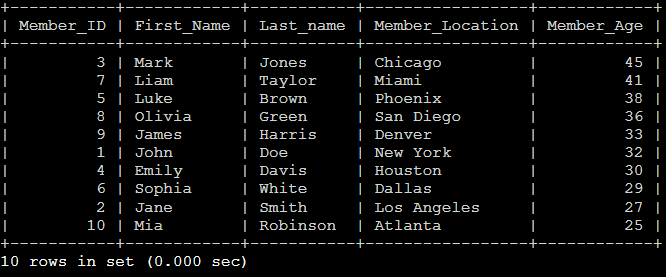

11. Count the total number of members in the Member table

`select count(*) as 'Number of Members' from Members;`

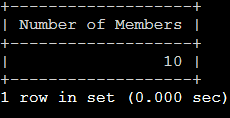

12. Retrieve all breakdowns that occurred in the year 2024

`select * from Breakdown where Breakdown_Date Like '2024%';`

13. Find breakdowns for vehicles with the registration 'ABC1234' or 'XYZ5678'

`select * from Breakdown where Vehicle_Registration in ( 'ABC1234', 'XYZ5678' );`

14. List all vehicles with the make 'Ford'

`select * from Vehicles where Vehicle_Make = 'Ford';`

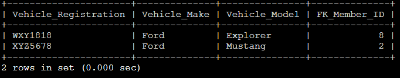

15. Find members whose first name starts with the letter 'J'

`select * from Members where First_Name like 'J%';`

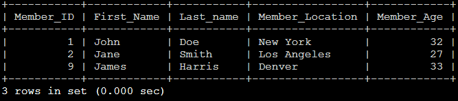

16. Retrieve breakdowns that occurred before 1st October 2024 (New date, not 1st September 2024)

`select * from Breakdown where Breakdown_Date < '2024-10-01';`

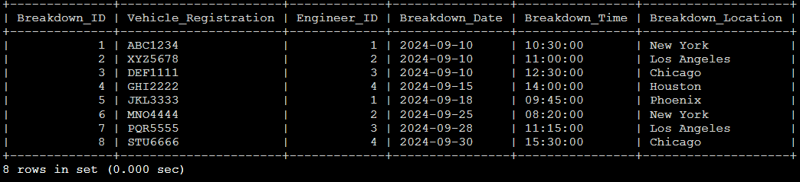

17. List members whose last name contains 'son

`select * from Members where Last_Name like '%son';`

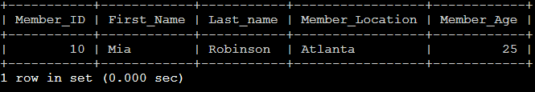

18. Find breakdowns that occurred in locations containing 'New'

`select * from Breakdown where Breakdown_Location like '%New%';`

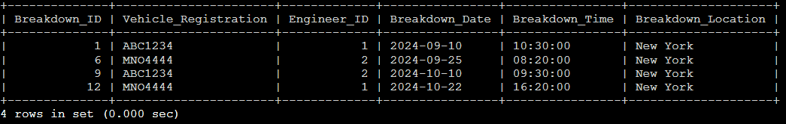

19. Retrieve the youngest member in the Member table.

`select concat( First_Name, ' ', Last_Name ) as 'Full Name', Min( Member_Age ) as 'Oldest Member' from Members where Member_Age = (select Min(Member_Age) from Members) order by Member_Age deSC limit 1;`

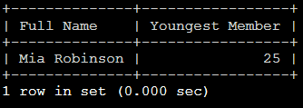

20. Retrieve the oldest member in the Member table

`select concat( First_Name, ' ', Last_Name ) as 'Full Name', max( Member_Age ) as 'Oldest Member' from Members where Member_Age = (select Max(Member_Age) from Members) order by Member_Age desc limit 1;`

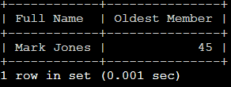

21. Find vehicles owned by members who live in Los Angeles

`select concat( Members.First_Name, ' ', Members.Last_Name ) as 'Full Name', Members.Member_Location, concat( Vehicles.Vehicle_Make, ' ', Vehicles.Vehicle_Model ) as 'Make / Model' from Members right join Vehicles on Members.Member_ID = Vehicles.FK_Member_ID where Members.Member_Location = 'Los Angeles';`

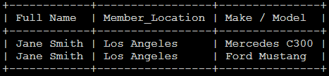

22. Retrieve all breakdowns handled by engineer with ID 1

`select * from Breakdown where Engineer_ID = 1;`

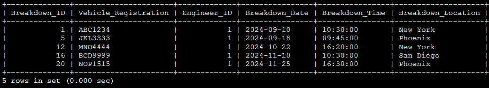

23. List all members who are younger than 35 years

`select concat ( First_Name, ' ', Last_Name ) as 'Full Name', Member_age from Members where Member_age < 35;`

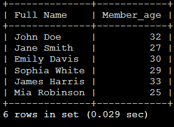

24. Find members who live in either Phoenix or Houston

`select * from Members where Member_Location in ( 'Phoenix', 'Houston' );`

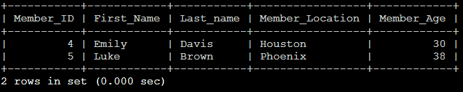

25. Retrieve vehicles where the model is either 'Civic' or 'Mustang'

`select * from Vehicles where Vehicle_Model in ( 'Civic', 'Mustang');`

26. List members whose first name contains the letter 'a'

`select concat (First_Name, ' ', Last_Name ) as 'Full Name' from Members where First_Name like '%a%';`

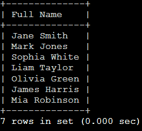

27. Retrieve breakdowns that occurred between 1st September to 30st September (New date as nothing for and between 1st August 2024, and 31st August 2024 

`select * from Breakdown where Breakdown_Date between '2024-09-01' and '2024-09-30';`

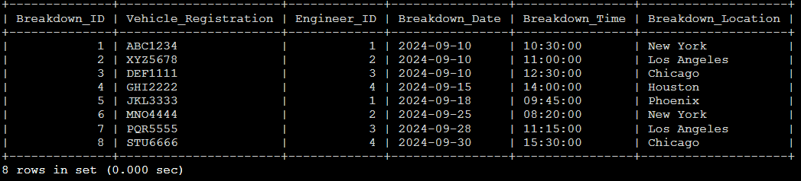

28. Find members whose age is not between 20 and 40 years

`select * from Members where Member_Age not between 20 and 40;`

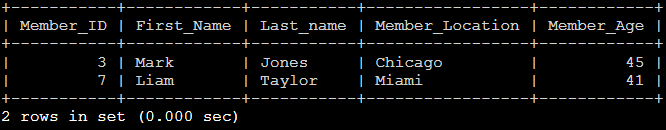

29. List breakdowns that occurred after October 1, 2024

`select * from Breakdown where Breakdown_Date > '2024-10-01';`

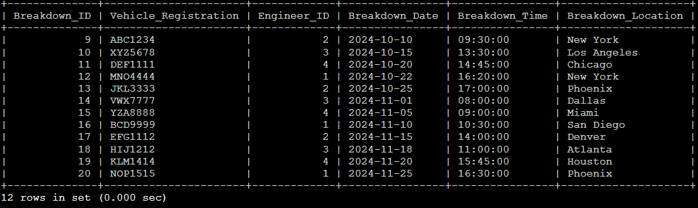

30. Retrieve the top 3 oldest members from the Member table

`select concat ( First_Name, ' ', Last_Name) as 'Full Name', Member_Age from Members order by Member_Age deSC limit 3;`

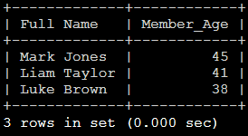

# Moderate Questions 
1. Count the number of breakdowns for each vehicle

`select Vehicle_Registration, count(*) as 'Number of Breakdowns' from Breakdown group by Vehicle_Registration;`

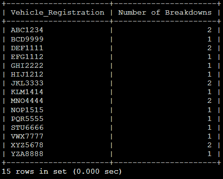

2. Find members who own more than one vehicle

`select count(Vehicles.FK_Member_ID) as 'Number of Cars', concat( First_Name, ' ', Last_Name) as 'Full Name' from Members right join  Vehicles on Members.Member_ID = Vehicles.FK_Member_ID group by Vehicles.FK_Member_ID having count( *) > 1 order by concat( First_Name, ' ', Last_Name) asc;`

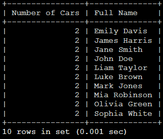

3. Retrieve the total number of breakdowns handled by each engineer

`select count(*) as 'Number of attended breakdowns', concat( Engineers.First_Name, ' ', Engineers.Last_Name ) as 'Engineer Name' from Breakdown right join Engineers on Breakdown.Engineer_ID = Engineers.Engineer_ID group by Breakdown.Engineer_ID;`

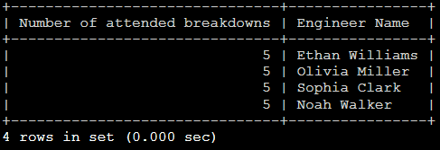

4. Group breakdowns by location and sort them by the total number of breakdowns in each location

`select count(Breakdown_Location) as 'Number of Breakdowns', Breakdown_Location as 'Location' from Breakdown group by Breakdown_Location order by count(Breakdown_Location) desc;`

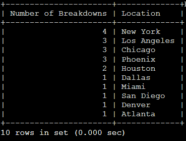

5. List vehicles owned by members who are younger than 30 years

`select concat( Vehicles.Vehicle_Make, ' ', Vehicles.Vehicle_Model ) as 'Make / Model', concat (Members.First_Name, ' ', Members.Last_name) as 'Full Name', Members.Member_Age from Members   right join Vehicles on Vehicles.FK_Member_ID = Members.Member_ID where Members.Member_Age < 30;`

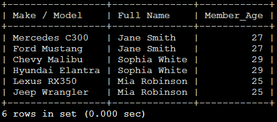

6. Retrieve all breakdowns and sort them by time in descending order (order by date, time)

`select * from Breakdown order by Breakdown_Date desc, Breakdown_Time;`

7. Find all breakdowns for vehicles owned by members who live in New York
`select concat( Members.First_Name, ' ', Members.Last_name) as 'Full Name', concat( Vehicles.Vehicle_Make, '/', Vehicles.Vehicle_Model ) as 'Make / model', Members.Member_Location as 'Home Location', Vehicles.Vehicle_Registration as 'Vehicle Registration', Breakdown.Breakdown_ID from Breakdown right join Vehicles on Breakdown.Vehicle_Registration = Vehicles.Vehicle_Registration right join Members on Vehicles.FK_Member_ID = Members.Member_ID where Members.Member_Location = 'New York' group by Vehicles.Vehicle_Registration;`
    
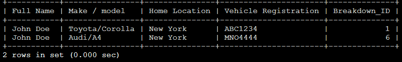

8. Retrieve members who do not own any vehicles

`select concat( Members.First_Name, ' ', Members.Last_name) as 'Owners with no cars' from Vehicles right join Members on Vehicles.FK_Member_ID = Members.Member_ID where Vehicles.Vehicle_Registration is NULL;`

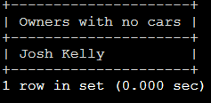

9. Find breakdowns that occurred in the same city where the vehicle owner resides

`select concat( Members.First_Name, ' ', Members.Last_name) as 'Full Name', Members.Member_Location as 'Accidents around home address' from Breakdown left join Vehicles on Breakdown.Vehicle_Registration = Vehicles.Vehicle_Registration left join Members on Breakdown.Breakdown_ID where Members.Member_Location = Breakdown.Breakdown_Location group by concat( Members.First_Name, ' ', Members.Last_name);`

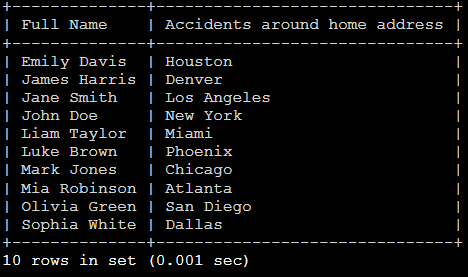

10. Retrieve the total number of breakdowns handled by each engineer during 2024

`Select concat(Engineers.First_Name, ' ', Engineers.Last_Name) as 'Engineers Name', count(Breakdown.Engineer_ID) as 'Breakdown Handled' from Breakdown right join Engineers on Breakdown.Engineer_ID = Engineers.Engineer_ID group by concat(Engineers.First_Name, ' ', Engineers.Last_Name);`

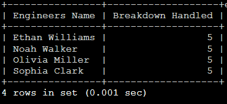

# Hard Questions 