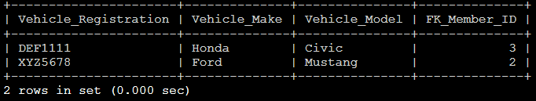
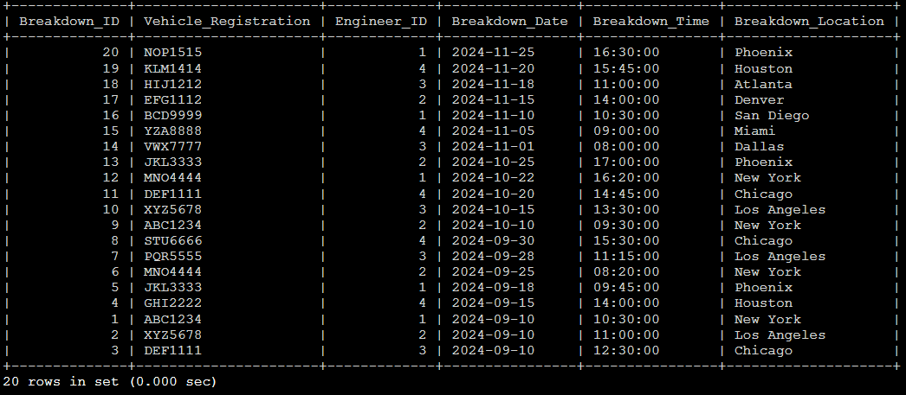
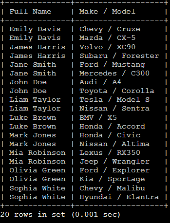
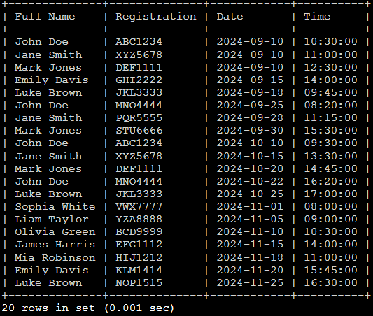
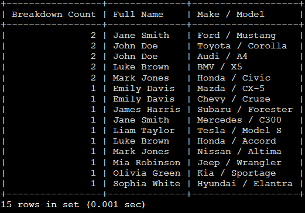
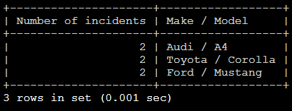
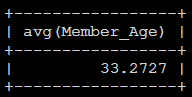
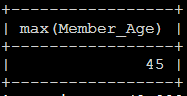
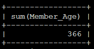

# SQL Assignment
## Contents
| Task | Section | 
|:---:|:---|
| Task 1 | Create Database and Input Values into Database |
| Task 2 | Simple Questions |
| Task 3 | Moderate Questions |
| Task 4 | Hard Questions |
| Task 5 | SQL Functions |
| Task 6 | Update and Delete Records | 

## Original 

[Assignment Details](assignment.pdf)

## Things to note 

> SQL Commands have been built and executed on MariaDB 10.11.6

# Task 1 - Create Database and Input Values into Database
I have created a .sql file containing the tables and data. So when the sql is inputted into MariaDB, all tables are created and all data is inserted.

[SQL File](create_database_and_input_data.sql)

# Task 2 - Simple Questions

1. Retrieve the first 5 members from the Members table

`select * from Members limit 5;`

2. Retrieve 5 members starting from the 6th row

`select * from Members limit 5 offset 5;`

3. List members who are older than 30 years

`select * from Members where Member_Age > 30;`

4. Find members who live in either New York or Los Angeles

`select * from Members where Member_Location in( 'New York' , 'Los Angeles');`

5. Retrieve all vehicles where the make is either 'Toyota' or 'Honda'

`select * from Vehicles where Vehicle_Make in ( 'Toyota', 'Honda' );`

6. Find members whose age is between 25 and 40 years

`select * from Members where Member_age between 25 and 40;`

7. List vehicles whose registration number starts with the letter 'A'

`select * from Vehicles where Vehicle_Registration like ‘A%’;`

8. Find vehicles where the model ends with the number '5'

`select * from Vehicles where Vehicle_Model Like '%5';`

9. List all engineers and order them alphabetically by their last name

`select * from Engineers Order by Last_Name ASC;`

10. Retrieve all members and order them by age in descending order

`select * from Members order by Member_Age DESC;`

11. Count the total number of members in the Member table

`select count(*) as 'Number of Members' from Members;`

12. Retrieve all breakdowns that occurred in the year 2024

`select * from Breakdown where Breakdown_Date Like '2024%';`

13. Find breakdowns for vehicles with the registration 'ABC1234' or 'XYZ5678'

`select * from Breakdown where Vehicle_Registration in ( 'ABC1234', 'XYZ5678' );`

14. List all vehicles with the make 'Ford'

`select * from Vehicles where Vehicle_Make = 'Ford';`

15. Find members whose first name starts with the letter 'J'

`select * from Members where First_Name like 'J%';`

16. Retrieve breakdowns that occurred before 1st October 2024 (New date, not 1st September 2024)

`select * from Breakdown where Breakdown_Date < '2024-10-01';`

17. List members whose last name contains 'son

`select * from Members where Last_Name like '%son';`

18. Find breakdowns that occurred in locations containing 'New'

`select * from Breakdown where Breakdown_Location like '%New%';`

19. Retrieve the youngest member in the Member table.

`select concat( First_Name, ' ', Last_Name ) as 'Full Name', Min( Member_Age ) as 'Youngest Member' from Members where Member_Age = (select Min(Member_Age) from Members) order by Member_Age deSC limit 1;`

20. Retrieve the oldest member in the Member table

`select concat( First_Name, ' ', Last_Name ) as 'Full Name', max( Member_Age ) as 'Oldest Member' from Members where Member_Age = (select Max(Member_Age) from Members) order by Member_Age desc limit 1;`

21. Find vehicles owned by members who live in Los Angeles

`select concat( Members.First_Name, ' ', Members.Last_Name ) as 'Full Name', Members.Member_Location, concat( Vehicles.Vehicle_Make, ' ', Vehicles.Vehicle_Model ) as 'Make / Model' from Members right join Vehicles on Members.Member_ID = Vehicles.FK_Member_ID where Members.Member_Location = 'Los Angeles';`

22. Retrieve all breakdowns handled by engineer with ID 1

`select * from Breakdown where Engineer_ID = 1;`

23. List all members who are younger than 35 years

`select concat ( First_Name, ' ', Last_Name ) as 'Full Name', Member_age from Members where Member_age < 35;`

24. Find members who live in either Phoenix or Houston

`select * from Members where Member_Location in ( 'Phoenix', 'Houston' );`

25. Retrieve vehicles where the model is either 'Civic' or 'Mustang'

`select * from Vehicles where Vehicle_Model in ( 'Civic', 'Mustang');`

26. List members whose first name contains the letter 'a'

`select concat (First_Name, ' ', Last_Name ) as 'Full Name' from Members where First_Name like '%a%';`

27. Retrieve breakdowns that occurred between 1st September to 30st September (New date as nothing for and between 1st August 2024, and 31st August 2024 

`select * from Breakdown where Breakdown_Date between '2024-09-01' and '2024-09-30';`

28. Find members whose age is not between 20 and 40 years

`select * from Members where Member_Age not between 20 and 40;`

29. List breakdowns that occurred after October 1, 2024

`select * from Breakdown where Breakdown_Date > '2024-10-01';`

30. Retrieve the top 3 oldest members from the Member table

`select concat ( First_Name, ' ', Last_Name) as 'Full Name', Member_Age from Members order by Member_Age deSC limit 3;`

# Task 3 - Moderate Questions 
1. Count the number of breakdowns for each vehicle

`select Vehicle_Registration, count(*) as 'Number of Breakdowns' from Breakdown group by Vehicle_Registration;`

2. Find members who own more than one vehicle

`select count(Vehicles.FK_Member_ID) as 'Number of Cars', concat( First_Name, ' ', Last_Name) as 'Full Name' from Members right join  Vehicles on Members.Member_ID = Vehicles.FK_Member_ID group by Vehicles.FK_Member_ID having count( *) > 1 order by concat( First_Name, ' ', Last_Name) asc;`

3. Retrieve the total number of breakdowns handled by each engineer

`select count(*) as 'Number of attended breakdowns', concat( Engineers.First_Name, ' ', Engineers.Last_Name ) as 'Engineer Name' from Breakdown right join Engineers on Breakdown.Engineer_ID = Engineers.Engineer_ID group by Breakdown.Engineer_ID;`

4. Group breakdowns by location and sort them by the total number of breakdowns in each location

`select count(Breakdown_Location) as 'Number of Breakdowns', Breakdown_Location as 'Location' from Breakdown group by Breakdown_Location order by count(Breakdown_Location) desc;`

5. List vehicles owned by members who are younger than 30 years

`select concat( Vehicles.Vehicle_Make, ' ', Vehicles.Vehicle_Model ) as 'Make / Model', concat (Members.First_Name, ' ', Members.Last_name) as 'Full Name', Members.Member_Age from Members   right join Vehicles on Vehicles.FK_Member_ID = Members.Member_ID where Members.Member_Age < 30;`

6. Retrieve all breakdowns and sort them by time in descending order (order by date, time)

`select * from Breakdown order by Breakdown_Date desc, Breakdown_Time;`

7. Find all breakdowns for vehicles owned by members who live in New York
`select concat( Members.First_Name, ' ', Members.Last_name) as 'Full Name', concat( Vehicles.Vehicle_Make, '/', Vehicles.Vehicle_Model ) as 'Make / model', Members.Member_Location as 'Home Location', Vehicles.Vehicle_Registration as 'Vehicle Registration', Breakdown.Breakdown_ID from Breakdown right join Vehicles on Breakdown.Vehicle_Registration = Vehicles.Vehicle_Registration right join Members on Vehicles.FK_Member_ID = Members.Member_ID where Members.Member_Location = 'New York' group by Vehicles.Vehicle_Registration;`
    

8. Retrieve members who do not own any vehicles

`select concat( Members.First_Name, ' ', Members.Last_name) as 'Owners with no cars' from Vehicles right join Members on Vehicles.FK_Member_ID = Members.Member_ID where Vehicles.Vehicle_Registration is NULL;`

9. Find breakdowns that occurred in the same city where the vehicle owner resides

`select concat( Members.First_Name, ' ', Members.Last_name) as 'Full Name', Members.Member_Location as 'Accidents around home address' from Breakdown left join Vehicles on Breakdown.Vehicle_Registration = Vehicles.Vehicle_Registration left join Members on Breakdown.Breakdown_ID where Members.Member_Location = Breakdown.Breakdown_Location group by concat( Members.First_Name, ' ', Members.Last_name);`

10. Retrieve the total number of breakdowns handled by each engineer during 2024

`Select concat(Engineers.First_Name, ' ', Engineers.Last_Name) as 'Engineers Name', count(Breakdown.Engineer_ID) as 'Breakdown Handled' from Breakdown right join Engineers on Breakdown.Engineer_ID = Engineers.Engineer_ID group by concat(Engineers.First_Name, ' ', Engineers.Last_Name);`

# Task 4 - Hard Questions 
1. Retrieve a list of members along with their vehicles using a join

`select concat( Members.First_Name, ' ', Members.Last_name) as 'Full Name', concat( Vehicles.Vehicle_Make, ' / ', Vehicles.Vehicle_Model ) as 'Make / Model' from Vehicles left join Members on Vehicles.FK_Member_ID = Members.Member_ID order by concat( Members.First_Name, ' ', Members.Last_name) asc;`

2. Retrieve breakdown details along with the respective member details using a join

`select concat( Members.First_Name, ' ', Members.Last_name) as 'Full Name', Breakdown.Vehicle_Registration as 'Registration', Breakdown.Breakdown_Date as 'Date', Breakdown.Breakdown_Time as 'Time' from Breakdown right join Vehicles on Breakdown.Vehicle_Registration = Vehicles.Vehicle_Registration right join Members on Vehicles.FK_Member_ID = Members.Member_ID where Breakdown.Vehicle_Registration is not null order by Breakdown.Breakdown_Date asc, Breakdown.Breakdown_Time;`

3. Find members who own a vehicle but have never experienced a breakdown

`select concat( Members.First_Name, ' ', Members.Last_name) as 'Full Name', Vehicles.Vehicle_Registration as 'Vehicles without any Breakdowns' from Members left join Vehicles on Members.Member_ID = Vehicles.FK_Member_ID left join Breakdown on Vehicles.Vehicle_Registration = Breakdown.Vehicle_Registration where Vehicles.Vehicle_Registration not in (select Vehicle_Registration from Breakdown group by Vehicle_Registration ) group by Vehicles.Vehicle_Registration;`

4. Retrieve vehicles along with the count of their breakdowns using a join and group by.

`select count(Breakdown.Vehicle_Registration) as 'Breakdown Count', concat(Members.First_Name, ' ', Members.Last_name) as 'Full Name', concat( Vehicles.Vehicle_Make, ' / ', Vehicles.Vehicle_Model ) as 'Make / Model' from Breakdown left join Vehicles on Breakdown.Vehicle_Registration = Vehicles.Vehicle_Registration right join Members on Vehicles.FK_Member_ID = Members.Member_ID where Breakdown.Vehicle_Registration is not null group by Vehicles.Vehicle_Registration order by count(Breakdown.Vehicle_Registration) desc , concat(Members.First_Name, ' ', Members.Last_name);`

10. Retrieve the top 3 vehicles with the highest number of breakdowns, ordered by breakdown count

`select count( Breakdown.Vehicle_Registration) as 'Number of incidents', concat( Vehicles.Vehicle_Make, ' / ', Vehicles.Vehicle_Model) as 'Make / Model' from Breakdown right join Vehicles on Breakdown.Vehicle_Registration = Vehicles.Vehicle_Registration group by Breakdown.Vehicle_Registration order by count( Breakdown.Vehicle_Registration) desc limit 3;`

# Task 5 - SQL Functions 

## Objective 
Research the following SQL Functions 
> AVG 

> MIN

> MAX

> SUM

## AVG
|  | Explanation |
|:---:|:---|
| Definition | A function to return the average value in a column |
| Example of use | Select avg(Member_Age) from Members |
| Returned Data |  | 

## MIN
|  | Explanation |
|:---:|:---|
| Definition | A function used to return the minimum or smallest value of a column | 
| Example of use | Select min(Member_Age) from Members | 
| Returned Data |  | 

## Max
|  | Explanation |
|:---:|:---|
| Definition | A function used to return the maximum or largest value of a column |
| Example of use | Select max(Member_Age) from Members | 
| Returned Data |  | 

## SUM 
|  | Explanation |
|:---:|:---|
| Definition | A function used to return the total sum of a column | 
| Example of use | Select sum(Member_Age) from Members
| Returned Data |  | 

# Task 6 - Update and Delete Records

## Update 3 in the engineers table

`Update Engineers set First_Name = 'Oliver' where First_Name = 'Olivia';`

`Update Engineers set Last_Name = 'Thompson' where First_Name = 'Ethan' and Engineer_ID = 1`

`Update Engineers set First_Name = 'Josh', Last_Name = 'Kelly' where Engineer_ID = 4`

## Delete 2 records in the breakdown table

`Delete from Breakdowns where Breakdown_ID = 2;`

`Delete from Breakdowns where Vehicle_Registration = 'XYZ5678';`